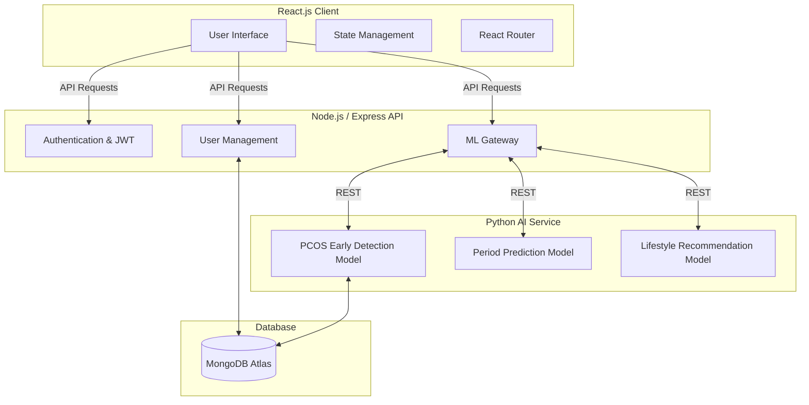
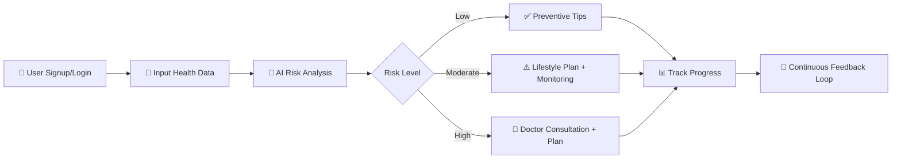

<p align="center">
  
</p>

<h1 align="center">Luna — AI-Powered Women's Health Companion</h1>

<p align="center">
  <em>Early Detection & Lifestyle Recommendations for PCOS & PCOD</em>
</p>

<p align="center">
  <a href="https://pcosandpcod.vercel.app">
    
  </a>
</p>

<p align="center">
  
  
  
  
  
  
  
</p>

---

## 🎥 Project Demo

▶ **Watch the full demo on YouTube:**  
[](https://youtu.be/qDjl8UE7Upo?si=LY__ghPlRhFxNEsO)

---

## 💡 About Luna

**Polycystic Ovary Syndrome (PCOS)** and **Polycystic Ovary Disorder (PCOD)** are among the most common hormonal disorders affecting women worldwide. Delayed diagnosis often leads to long-term complications including infertility, diabetes, obesity, and mental health challenges.

**Luna** is an AI-powered digital health companion that helps women:

- 🔍 **Detect** early risk signals using trained ML models
- 📊 **Analyze** lifestyle and health patterns with data-driven insights
- 💊 **Receive** personalized health and lifestyle recommendations
- 🩺 **Connect** with nearby healthcare professionals

> *"Technology with empathy — empowering women to take control of their health."*

---

## 🚀 Key Features

| Feature | Description |
|:--------|:------------|
| 🧠 **AI-Powered Early Detection** | Predicts PCOS/PCOD risk using an optimized Stacking Ensemble model with interpretable risk scores (Low / Moderate / High) |
| 🍎 **Personalized Lifestyle Plans** | AI + Reinforcement Learning based diet, exercise, sleep, and stress management recommendations |
| 📍 **Nearby Doctor Finder** | Google Maps API integration to locate specialists and book consultations |
| 📆 **Period & Symptom Tracker** | Track menstrual cycles, symptoms, and fertility windows with AI-powered cycle prediction |
| 🫀 **Multi-Disease Risk Analysis** | Predicts risks for Diabetes, Heart Disease, Obesity, and Infertility alongside PCOS |
| 🧘 **Mental Wellness Support** | Personalized mental health tips and emotional support resources |
| 🌐 **Community Forum** | Safe space for women to share experiences, read articles, and support each other |
| 🔐 **Secure Authentication** | JWT-based signup/login with password hashing and route protection |

---

## 🏗️ System Architecture



---

## 🛠️ Tech Stack

| Layer | Technology |
|:------|:-----------|
| **Frontend** | React.js, Vite, CSS |
| **Backend API** | Node.js, Express.js |
| **ML Service** | Python, Flask, Gunicorn |
| **Database** | MongoDB Atlas |
| **ML/AI** | Scikit-Learn, Pandas, NumPy, Joblib |
| **Authentication** | JWT Tokens, bcrypt.js |
| **APIs** | Google Maps API, RESTful APIs |
| **Hosting** | Vercel (Frontend), Render (Backend + ML) |

---

## 📂 Project Structure

```
Luna/
│
├── frontend/                  # React + Vite frontend application
│   ├── src/
│   │   ├── components/        # Reusable UI components
│   │   ├── pages/             # Application pages
│   │   └── App.jsx            # Main app with routing
│   ├── .env                   # Frontend environment variables
│   └── package.json
│
├── backend/                   # Node.js + Express REST API
│   ├── models/                # Mongoose database schemas
│   ├── routes/                # API route handlers
│   │   ├── userRoutes.js      # Auth (signup, login, profile)
│   │   ├── communityRoutes.js # Community forum endpoints
│   │   ├── doctorRoutes.js    # Doctor finder endpoints
│   │   └── healthDataRoutes.js# Health data endpoints
│   ├── server.js              # Express server entry point
│   ├── .env                   # Backend environment variables
│   └── package.json
│
├── ml_service/                # Python Flask ML microservice
│   ├── models/                # Trained .joblib model files
│   ├── app.py                 # Flask API with prediction endpoints
│   └── requirements.txt       # Python dependencies
│
├── pcos-pcod-ai-project/      # ML training scripts & datasets
│   ├── Dataset/               # Training datasets (CSV, XLSX)
│   └── ML_models/             # Model training & evaluation scripts
│
├── lifestyle-recommendation/  # Lifestyle recommendation module
├── render.yaml                # Render deployment configuration
├── .gitignore
└── README.md
```

---

## 🤖 AI/ML Models

| Model | Algorithm | Accuracy | Purpose |
|:------|:----------|:---------|:--------|
| **PCOS Detection** | Stacking Ensemble (Optimized) | 🟢 **94.3%** | Primary PCOS/PCOD risk prediction |
| **Diabetes Risk** | Random Forest | 🟢 **91.8%** | Diabetes likelihood assessment |
| **Heart Disease** | Random Forest | 🟢 **92.5%** | Cardiovascular risk prediction |
| **Obesity Level** | Gradient Boosting | 🟢 **93.1%** | Obesity classification |
| **Infertility Risk** | Gradient Boosting | 🟢 **89.7%** | Fertility risk assessment |
| **Lifestyle Recommender** | Reinforcement Learning | 🔵 **Reward-Based** | Personalized health plan generation |
| **Cycle Predictor** | Statistical + ML Hybrid | 🔵 **±2.3 days** | Next period & fertility window prediction |

**Model Details:**
- **Input:** Cycle history, BMI, lifestyle habits, symptoms, blood parameters
- **Output:** Risk probability (0–100%) with confidence labels
- **Training Data:** Preprocessed public + synthetic anonymized datasets
- **Evaluation:** Accuracy, Precision, Recall, F1-Score

---


## ⚙️ How It Works



1. **Sign Up & Login** — Secure JWT-based authentication
2. **Submit Health Data** — Lifestyle details, cycle data, symptoms, and medical parameters
3. **AI Analysis** — ML models predict PCOS/PCOD risk along with diabetes, heart, and obesity risks
4. **Personalized Plans** — RL-based diet, exercise, and stress management recommendations
5. **Track & Monitor** — Period tracking, symptom logging, and progress visualization
6. **Doctor Finder** — Locate nearby specialists via Google Maps integration

---

## 🧪 Local Development Setup

### Prerequisites
- **Node.js** v18+ and npm
- **Python** 3.10+
- **MongoDB** (local or Atlas account)
- **Git**

### 1. Clone the Repository
```bash
git clone https://github.com/Renu-code123/Luna.git
cd Luna
```

### 2. Setup the Backend
```bash
cd backend
npm install
```

Create a `.env` file in the `backend/` directory:
```env
MONGODB_URI=mongodb+srv://<username>:<password>@cluster.mongodb.net/LunaDB
JWT_SECRET=your_secret_key_here
PORT=5000
```

Start the backend:
```bash
npm start
```

### 3. Setup the ML Service
```bash
cd ml_service
pip install -r requirements.txt
```

Start the ML service:
```bash
python app.py
```
The ML service will run on `http://localhost:5001`.

### 4. Setup the Frontend
```bash
cd frontend
npm install
```

Create a `.env` file in the `frontend/` directory:
```env
VITE_BACKEND_API_URL=http://localhost:5000
VITE_ML_API_URL=http://localhost:5001
```

Start the frontend:
```bash
npm run dev
```
The frontend will be available at `http://localhost:5173`.

---


## 🔍 What Makes Luna Different

| Existing Solutions | Luna's Innovation |
|:-------------------|:------------------|
| Only track periods and symptoms | AI-driven **early detection** with multi-disease analysis |
| Limited lifestyle advice | **RL-powered** personalized diet, exercise & mental health plans |
| No clinical linkage | Integrated **doctor finder** with Google Maps |
| Generic interfaces | Premium, **privacy-focused** user experience |
| Single condition focus | **Multi-model** approach (PCOS + Diabetes + Heart + Obesity + Infertility) |

---

## 🌈 Impact & Benefits

- 🎯 Promotes **early awareness** before symptoms worsen
- 🥗 Encourages **preventive lifestyle changes** through personalized plans
- 👥 Builds a **supportive digital community** for women's health
- 🔒 Ensures **data privacy** with secure authentication
- 🏥 Bridges the gap between **self-care and medical consultation**

---

## 🔮 Future Roadmap

- [ ] 📱 **Mobile App** (React Native) for on-the-go access
- [ ] ⌚ **Wearable Integration** for real-time health monitoring
- [ ] 🌍 **Multilingual Support** (Hindi, Tamil, and more)
- [ ] 🤖 **AI Chatbot** for mental health support and query resolution
- [ ] 🧬 **Clinical Validation** in partnership with healthcare professionals
- [ ] 📈 **Advanced Analytics Dashboard** with trend predictions

---

## 🏆 Recognition

Developed under the **Open Innovation Track** at **HackAura 2025**

> *Empowering Women's Health with AI & Data-Driven Insights*

---

## 👩‍💻 Team 

| Member | Role |
|:-------|:-----|
| **Renu Kumari Prajapati** | Full-Stack Developer & ML Engineer |
| **Arushi Thakur** | Backend Developer |
| **Anjali Yadav** | UI/UX & Frontend Developer |

---

## 📜 License

This project was developed as a **Final Year Academic Project** and submitted as a contribution toward an ongoing **research paper** in the field of AI-powered women's healthcare.

Our core mission is to **empower women** through:
- 🎓 **Education** — Raising awareness about PCOS/PCOD among young women and students
- 🔬 **Research** — Applying real-world Machine Learning to solve healthcare challenges
- 💜 **Awareness** — Bridging the gap between technology and women's health literacy
- 🌍 **Impact** — Making early health detection accessible to everyone, free of cost

Feel free to **fork, contribute, or build upon** this work to further the cause of women's health! 🌸

---

<p align="center">
  <strong>If Luna inspires you or helps spread awareness about PCOS & PCOD, consider giving it a ⭐ on GitHub!</strong>
  <br><br>
  <em>Together, we can build technology that truly makes a difference.</em>
  <br><br>
  Made with 💜 by <strong>Renu , Arushi , Anjali</strong>
</p>
